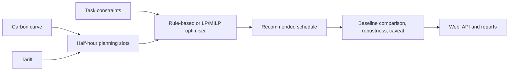
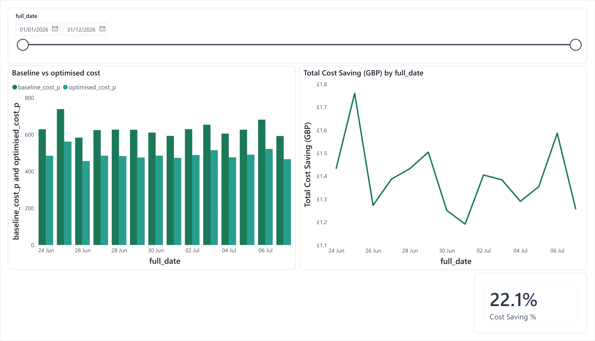
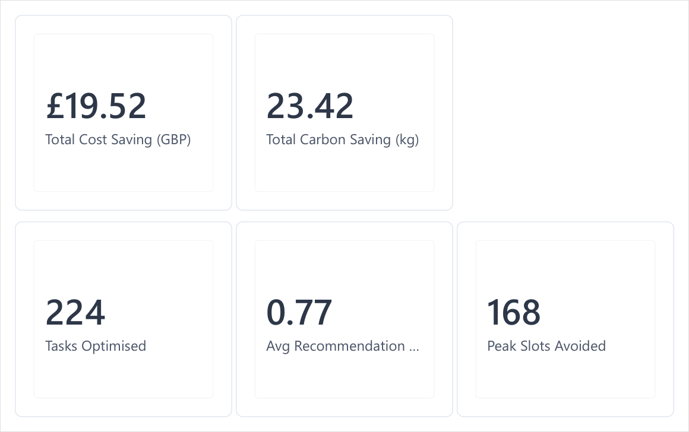

# Community Energy Flex

Community Energy Flex is a decision-support system for scheduling flexible household electricity tasks. It combines half-hourly carbon data, tariff inputs, task constraints, and rule-based or linear-programming optimisers to recommend feasible run windows with explicit baselines, provenance, and caveats.

It is a portfolio demonstration, not a control system or a savings guarantee. The case-study, Power BI, and synthetic stress-test figures use illustrative household data; they are not measured customer outcomes.

**[Open the web app](https://after-midnight-beta.vercel.app/)** · **[API documentation](https://community-energy-flex-api.fly.dev/docs)** · **[Read the worked example](docs/CASE_STUDY.md)**

[](https://after-midnight-beta.vercel.app/)

[](https://github.com/rosscyking1115/community-energy-flex/actions/workflows/ci.yml)

## What it demonstrates

- A typed Python domain model for tasks, half-hour slots, tariffs, schedules, and baselines.
- Rule-based and LP/MILP scheduling under time, energy, and overlap constraints.
- A FastAPI contract that reports the actual carbon and price source, whether it is live, and any fallback reason.
- A Next.js interface that keeps fallback/sample status visible instead of presenting it as live data.
- A robustness indicator that describes sensitivity to current inputs. It is a heuristic, not a calibrated probability.
- Conditional ex-post scenario analysis. Because task adherence is not observed, this is a synthetic stress test rather than realised-savings evidence.
- Text, Excel, PDF, dbt, Snowflake, Dagster, and Power BI reporting paths.

## Try it

The public endpoints keep their original hostnames; those URLs are stable deployment identifiers, not the current product name.

| Surface | URL | Notes |
|---|---|---|
| Web app | [after-midnight-beta.vercel.app](https://after-midnight-beta.vercel.app/) | Next.js on Vercel |
| API | [community-energy-flex-api.fly.dev](https://community-energy-flex-api.fly.dev/docs) | FastAPI on Fly.io |

The API attempts the GB Carbon Intensity forecast for supported regions. If that source is unavailable, the response names the fallback profile and explains why it was used. Northern Ireland uses a labelled typical profile; it is not advertised as a live forecast.

## Run locally

Python 3.11–3.13 is supported.

```bash
python -m venv .venv
# Windows: .venv\Scripts\activate
# macOS/Linux: source .venv/bin/activate
pip install -e ".[dev,reports,api,app,optim]"
python -m pytest
python -m ruff check .
```

Run the API and web client in separate terminals:

```bash
uvicorn community_energy_api.main:app --app-dir api --reload
cd web
npm install
npm run dev
```

A Streamlit interface is also included:

```bash
streamlit run app/streamlit_app.py
```

## Decision flow



For each task, the engine enumerates feasible starts, estimates cost and carbon for each window, applies the selected objective, and compares the recommendation with an explicit preferred-start baseline. Standing charges are excluded because moving a task does not change them.

The robustness indicator combines decisiveness, forecast horizon, data-source quality, and tariff quality. It is deliberately labelled as an indicator rather than confidence: it has not been calibrated against observed recommendation outcomes.

See [Methodology](docs/METHODOLOGY.md) for the equations and limitations.

## Provenance and credibility boundary

The public contract exposes structured source metadata:

- `carbon_source`, `carbon_source_label`, `is_live_forecast`, retrieval/valid timestamps, and `fallback_reason`;
- `price_source`, `price_source_label`, `price_is_live`, and `price_unavailable_reason`;
- `supports_live_forecast` as a regional capability flag, separate from whether a particular response actually used live data.

The synthetic retro workflow recomputes the scheduled and baseline windows against altered carbon curves. It does not observe whether a household followed the recommendation, so its outputs are named **conditional ex-post savings** and `schedule_adherence_observed` is false.

Project claims and evidence boundaries are tracked in the [claim ledger](docs/CLAIM_LEDGER.md). Current operating state and freeze scope are in [status](docs/STATUS.md).

## Power BI stakeholder dashboard





Both dashboard images use synthetic-household demonstration data. The model, DAX, theme, and reproducible seed path are in [`powerbi/`](powerbi/); see the [dashboard guide](docs/POWERBI_DASHBOARD_GUIDE.md).

## Repository map

| Path | Responsibility |
|---|---|
| `src/community_energy_flex/` | Domain model, data sources, optimisation, monitoring, reporting |
| `api/community_energy_api/` | FastAPI contract and service adapter |
| `web/` | Next.js public interface |
| `tests/`, `api/tests/` | Unit, contract, fallback, robustness, and export tests |
| `dbt_energy/`, `warehouse/` | Analytics transformations and Snowflake bootstrap |
| `orchestration/` | Dagster assets |
| `powerbi/` | Dashboard model, measures, theme, and guidance |
| `docs/evidence/credibility-closeout/` | Versioned closeout evidence |

## Documentation

| Document | Purpose |
|---|---|
| [Status](docs/STATUS.md) | Current scope, limitations, and feature freeze |
| [Claim ledger](docs/CLAIM_LEDGER.md) | Public claims and their evidence status |
| [Data sources](docs/DATA_SOURCES.md) | Source semantics and fallback rules |
| [Methodology](docs/METHODOLOGY.md) | Baseline, objectives, robustness, and conditional ex-post analysis |
| [Architecture](docs/ARCHITECTURE.md) | Module boundaries and request flow |
| [Runbook](docs/RUNBOOK.md) | Local operation and failure modes |
| [Future research](docs/FUTURE_RESEARCH.md) | Work intentionally deferred beyond v0.2.0 |
| [Security](SECURITY.md) | Responsible disclosure |

## Project status

Version 0.2.1 continues the v0.2.0 credibility closeout; it remains a feature-freeze release, with post-release correctness and honesty fixes. Maintenance is limited to correctness, dependency and security updates, and deployment reliability; new research claims require new observed evidence and an explicit scope decision.

MIT © 2026 Cheng-Yuan King.
