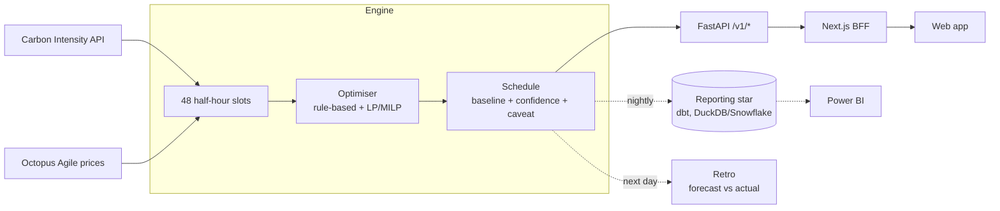

# After Midnight

**After Midnight** is the web app; `community-energy-flex` is the repository (the
full-stack data + optimisation project behind it).

> Works out **when** to run flexible electricity loads — a wash, an EV charge — to
> cut cost and carbon, from live UK grid data, and shows the working.

[](https://github.com/rosscyking1115/community-energy-flex/actions/workflows/ci.yml)
[](LICENSE)
[](pyproject.toml)
[](https://github.com/rosscyking1115/community-energy-flex/actions/workflows/ci.yml)

> A personal, open-source **learning project** — a small full-stack + data-engineering
> build on UK public energy data. **Not a product**, and it doesn't need to be
> (see [Why this exists](#why-this-exists)). Built to be read: live-API integration,
> a scheduling/optimisation engine, a typed contract, and a front end.

> One of three UK open-data builds on my profile — siblings
> [tfl-data-engineering](https://github.com/rosscyking1115/tfl-data-engineering) and
> [uk-housing-decision-support](https://github.com/rosscyking1115/uk-housing-decision-support)
> cover the pipeline side; this one closes the loop with optimisation and a
> forecast-vs-actual retro. Full project map →
> [profile](https://github.com/rosscyking1115).

**▶ [Live demo](https://after-midnight-beta.vercel.app/)** · [API docs](https://community-energy-flex-api.fly.dev/docs) · [worked example](docs/CASE_STUDY.md)

[](https://after-midnight-beta.vercel.app/)

It doesn't just show *"carbon is low at 02:00."* It says *"run the washing machine
02:30–04:00, charge the EV 01:30–04:30, expected saving £0.12 and 0.14 kg CO₂,
high confidence"* — with the assumptions and caveats attached.

> [!TIP]
> **Worked example:** Riverside Community Centre — four flexible loads, no
> batteries, no solar, no smart meter — saves **~£149 and ~179 kg CO₂ a year**
> just by shifting *when* things run. And when the grid came in ~8% dirtier than
> forecast, the plan still realised **108% of its forecast carbon saving**. Read
> the full worked example → [docs/CASE_STUDY.md](docs/CASE_STUDY.md).

> [!NOTE]
> Planning advice only. This tool does not control appliances, guarantee savings,
> or replace official energy or supplier advice.

## Why this exists

To build and show a complete data path end to end — live public APIs → a
warehouse → an optimiser → a typed API → a front end — on a problem I find
genuinely interesting, not to fill a market gap. There isn't one, and that's
stated up front on purpose:

- **Octopus** already publishes a free [Greener Nights](https://octopus.energy/blog/greener-days-and-nights/)
  forecast and auto-schedules cheapest/greenest charging on Intelligent Octopus Go.
- Free third-party sites — **UK Grid Live**, **Energy Stats UK**, **AgileBuddy** —
  do essentially this on the same public data.

So this is a **learning / personal-utility build**, valued for the engineering on
display rather than as something to adopt. The interesting parts, for a reviewer:

- **Contract-first, typed end to end** — pydantic models → OpenAPI → generated
  TypeScript, so the API and the front end can't silently drift.
- **Graceful degradation by design** — every live feed is TTL-cached with a
  last-good / sample fallback, so an upstream outage never takes the app down.
- **It closes the loop** — a [forecast-vs-actual **retro**](docs/RETRO.md) ("did
  yesterday's plan actually save?") measures realised vs forecast savings, not just
  predicted ones. Worst case in the demo still saved; on average, 95% realised.

## Live

- **Web app:** [after-midnight-beta.vercel.app](https://after-midnight-beta.vercel.app/) (Next.js on Vercel)
- **API:** [community-energy-flex-api.fly.dev](https://community-energy-flex-api.fly.dev) — [OpenAPI docs](https://community-energy-flex-api.fly.dev/docs) (FastAPI on Fly.io, keyless)

The API is callable directly:

```bash
# tonight's cleanest/cheapest window for a load in London, from live data
curl -s https://community-energy-flex-api.fly.dev/v1/optimise \
  -H 'content-type: application/json' \
  -d '{"region_id":"london","tariff":{"kind":"agile"},"objective":"balanced",
       "tasks":[{"name":"Washing machine","device_type":"Washing machine",
       "energy_kwh":0.8,"duration_hours":1.5,"earliest":"00:00","latest":"08:00",
       "preferred":"06:30"}]}'
```

Endpoints: `/v1/regions`, `/v1/appliances`, `/v1/tariffs/agile/{region}`,
`/v1/forecast/{region}` (the 48-slot carbon + price curve), `/v1/optimise`. Data
is live: GB regional carbon (NESO / National Grid Carbon Intensity) and Octopus
Agile prices, with an EirGrid typical-day profile for Northern Ireland.

The web front end that consumes it — a Next.js app built around a full-day
carbon/price band — lives in [`web/`](web); see
[docs/DEPLOYMENT.md](docs/DEPLOYMENT.md) to run or deploy it.

## What's inside

The full data path, end to end:

- **Optimiser** — rule-based (cheapest / greenest / balanced / avoid-peak) plus an
  LP/MILP optimiser (PuLP) that schedules loads jointly under a peak-load cap. Every
  recommendation carries a baseline comparison, a confidence band, and a caveat.
- **API + front end** — a FastAPI service wrapping the engine (live on Fly.io) and a
  Next.js app wired to it through a server-side BFF (typed end to end).
- **Data** — GB Carbon Intensity API; tariff models (flat / Economy 7 / time-of-use /
  Octopus Agile); Open-Meteo weather.
- **Warehouse** — dbt on DuckDB (dev) with a Snowflake target, plus a reporting star.
- **Orchestration** — a Dagster daily pipeline with keep-last-good-schedule fallback
  and a **forecast-vs-actual retro loop** ("did yesterday's plan actually save?").
- **Apps & reports** — a Streamlit decision app, a Power BI stakeholder dashboard,
  and text / Excel / PDF action reports.
- **Access control** — role-based scoping + an audit trail, enforced in the app and
  (defence in depth) by Snowflake row-access policies.
- **Tracking** — an MLflow comparison of optimiser strategies.

## Quickstart

**One command** — install and run the worked example end to end (no API keys, no
services needed):

```bash
python -m pip install -e ".[dev]" && python scripts/case_study.py
```

It prints a real optimised plan, the £/CO₂ saved, and the forecast-vs-actual
retro. Then the rest of the toolbox:

```bash
python -m pytest                            # the full suite (151 tests)
python -m community_energy_flex cheapest    # optimise on sample data
python scripts/retro_demo.py                # the forecast-vs-actual table
```

Run the decision app:

```bash
python -m pip install -e ".[app,reports]"
streamlit run app/streamlit_app.py
```

Run the public API locally:

```bash
python -m pip install -e ".[api]"
python -m uvicorn community_energy_api.main:app --app-dir api --port 8000
```

Everything else — warehouse, pipeline, LP optimiser, MLflow, Power BI data — is an
optional extra. See [docs/RUNBOOK.md](docs/RUNBOOK.md) to run each piece.

## How it works



The engine lives in `src/community_energy_flex`. One idea ties it together: **the
day is 48 half-hour slots**, so tasks, tariffs, and carbon forecasts all share a
single clean integer axis.

**How a recommendation is derived** — worked for a washing machine (0.8 kWh, 1.5 h,
must finish by 08:00, usually run at 19:00):

1. **Get the day.** Fetch the region's 48-slot carbon forecast and the half-hourly
   Agile prices. Slot 0 = 00:00 … slot 47 = 23:30.
2. **Score every feasible start.** For each start the task could take inside its
   window, score it by that window's average price and average carbon, blended by
   the objective's weight (*avoid-peak* adds a penalty over 16:00–19:00).
3. **Pick the best, measure vs the baseline.** The lowest-scoring window wins, and
   it's scored against *your usual start* — so the saving is "vs what you'd have
   done", never a best case. → **run 02:30–04:00 instead of 19:00**.
4. **Attach the honesty.** Cost and carbon saved (~**14p / 180 g**), a **confidence**
   band (broad, stable trough → High; sensitive → Low), and a plain **caveat** —
   never a guarantee.
5. **Check it the next day.** The [retro](docs/RETRO.md) re-scores that committed
   plan against the measured actuals — realised vs forecast.

The maths behind the baseline, the scoring, and confidence is in
[docs/METHODOLOGY.md](docs/METHODOLOGY.md).

## Power BI stakeholder dashboard


A stakeholder view over the reporting star (dbt → DuckDB/Snowflake): cost/carbon
savings, peak-slot avoidance, and per-device and per-community breakdowns, with an
"advice-only" confidence disclaimer. Model + DAX in [`powerbi/`](powerbi/); see the
[dashboard guide](docs/POWERBI_DASHBOARD_GUIDE.md). Figures are from the worked case
study (synthetic households), not production results.

## Project layout

| Path | What's there |
|---|---|
| `src/community_energy_flex/` | Core engine: `domain/`, `data_sources/`, `optimisation/`, `reporting/`, `pipeline/`, `monitoring/`, `auth/`, `experiments/` |
| `api/` | Public FastAPI service (`community_energy_api`) — regions, appliances, live carbon/Agile forecast, optimise |
| `web/` | Next.js web front end — the planner UI, wired to the API through a BFF |
| `app/streamlit_app.py` | The Streamlit decision app (power-user / ops tool) |
| `orchestration/` | Dagster assets/jobs/schedules (thin wrappers over `pipeline/`) |
| `dbt_energy/` | dbt warehouse (DuckDB dev + Snowflake target), staging → options mart + reporting star |
| `warehouse/` | Snowflake bootstrap DDL + row-access policies |
| `powerbi/` | Dashboard `.pbix`, DAX measures, theme |
| `tests/` · `api/tests/` | Optimiser invariants, confidence, tariffs, reports, auth, API |
| `docs/` | See the index below |

### Docs

| Doc | What |
|---|---|
| [PRODUCT_THESIS](docs/PRODUCT_THESIS.md) · [ROADMAP](docs/ROADMAP.md) | Why it exists; the build plan |
| [CASE_STUDY](docs/CASE_STUDY.md) | Worked community-centre example (start here) |
| [RETRO](docs/RETRO.md) | Forecast-vs-actual loop — "did yesterday's plan actually save?" |
| [METHODOLOGY](docs/METHODOLOGY.md) | Baseline, cost/carbon maths, confidence |
| [ARCHITECTURE](docs/ARCHITECTURE.md) | Layers, deep-module review, ADRs |
| [DEPLOYMENT](docs/DEPLOYMENT.md) | API on Fly.io + web on Vercel |
| [DATA_SOURCES](docs/DATA_SOURCES.md) · [SAFETY_AND_PRIVACY](docs/SAFETY_AND_PRIVACY.md) | Inputs & licensing; safety, privacy, RBAC scope |
| [SNOWFLAKE_SETUP](docs/SNOWFLAKE_SETUP.md) · [DAGSTER_PIPELINE](docs/DAGSTER_PIPELINE.md) | Warehouse & orchestration |
| [POWERBI_DASHBOARD_GUIDE](docs/POWERBI_DASHBOARD_GUIDE.md) · [POWERBI_MODEL_REVIEW](docs/POWERBI_MODEL_REVIEW.md) · [POWERBI_COPILOT_HANDOFF](docs/POWERBI_COPILOT_HANDOFF.md) | Build, review, and polish the dashboard |
| [RBAC_MODEL](docs/RBAC_MODEL.md) | Roles, two-layer enforcement, OIDC |
| [RUNBOOK](docs/RUNBOOK.md) | Operate it; failure handling |

## Data sources

- **GB Carbon Intensity API** (carbonintensity.org.uk) — free, no key.
- **Octopus Agile** — live half-hourly unit rates by region (GSP group).
- **EirGrid** — a typical-day carbon profile for Northern Ireland (no live GB feed).
- **Weather** — Open-Meteo (free, no key), for the demand/solar features.

See [docs/DATA_SOURCES.md](docs/DATA_SOURCES.md) for fields and licensing.

## Status

| Piece | State |
|---|---|
| Engine, warehouse, Streamlit app, Power BI, RBAC | Done (v0.1.0) |
| Public API (FastAPI) | **Live** on Fly.io |
| Web front end (Next.js) | **Live** on Vercel |

Scope is intentionally **capped** — this is a portfolio build, not a roadmap to a
product. UK region coverage (all 14 GB GSP regions + Northern Ireland) is complete;
no further data or feature expansion is planned.

## Contributing & licence

Contributions welcome — see [CONTRIBUTING.md](CONTRIBUTING.md). MIT [LICENSE](LICENSE).
